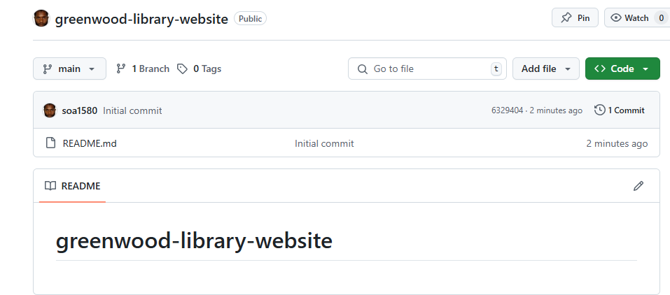
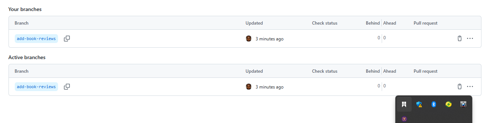
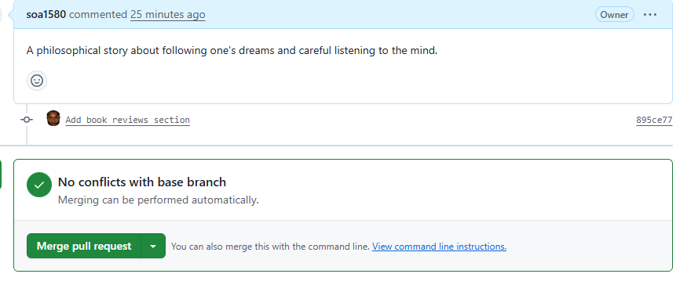
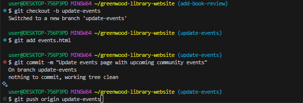
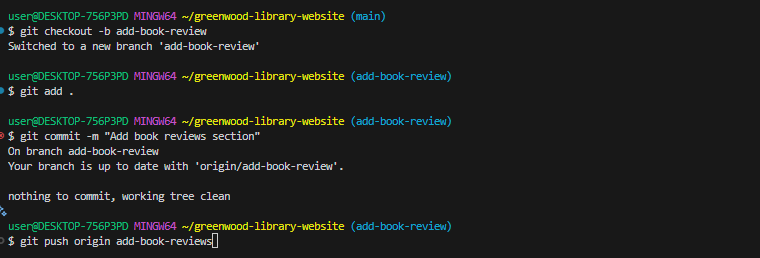

# greenwood-library-website

## The updating and enhancement of the Greenwood Library Website were implemented by Morgan and Jamie through a series of cordinated tasks

1. ### Creation of the repository for the Greenwood LibraryS

2. ### Creation of branches for both

3. ### The creation of merge before the pull request

4. ### Showing the execution of terminal command for both Morgan and Jamie

5. ### Succesfully merged the pull request for Morgan and Jamie after reviews

